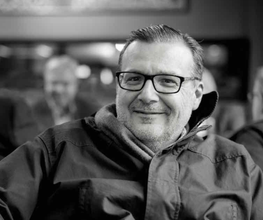

     
# Mauricio D. Sacchi

Professor, Department of Physics  
University of Alberta, Edmonton, Canada  

Email: <a href="mailto:msacchi@ualberta.ca">msacchi@ualberta.ca</a>  
GitHub: <a href="https://github.com/msacchi">msacchi</a>  

---

## About

I am a Professor of Physics at the University of Alberta, where I lead the  
**Signal Analysis and Imaging Group (SAIG)**.

My work is at the intersection of

- **Inverse problems**
- **Seismic imaging and wavefield modeling**
- **Statistical and sparse signal processing**
- **Computational geophysics and numerical methods**

with a strong emphasis on algorithmic development, open-source software, and  
training students to connect physical modeling with modern optimization and machine learning ideas.

---

## Research Interests

- Full waveform inversion (FWI) and wave-equation imaging  
- Sparsity-promoting methods and compressed sensing for seismic data  
- Multichannel prediction filters, MSSA/Cadzow, and tensor methods  
- Time–frequency and time–scale representations  
- Uncertainty quantification and Bayesian inversion  
- Machine learning for seismic processing and imaging  

If you are interested in MSc/PhD or postdoctoral work related to these topics,  
feel free to contact me by email.

---

## News

- 2025 – Developing Julia-based teaching material for **Computational Physics (PHYS 420/580)**.  
- 2025 – Ongoing projects on FWI, tensor methods for seismic reconstruction, and diffusion-based models for 3D data processing.  
- 2024–2025 – Several papers under review on sparsity-promoting reconstruction, tensor networks, and diffusion models for seismic data.

*(More detailed news can go here as you like.)*

---

## Teaching

At the University of Alberta I regularly teach or have taught:

- **PHYS 420 / 580 – Computational Physics**  
  Emphasis on Julia, operator-based formulations, PDE solvers, Monte Carlo, and inverse problems.

- **GEOPH 426 / 526 – Seismic Data Processing**  
  Classical and modern signal processing for seismic data: FX prediction filters, Radon transforms, deconvolution, and rank-reduction methods.

- Special topics in **Inverse Problems**, **Wave Propagation & Imaging**, and  
  **Signal Processing for Geophysical Applications**.

Whenever possible, course examples are implemented in **Julia** and released as open material so that students can extend them into their own research tools.

---

## Students & Group

I supervise MSc and PhD students in physics, geophysics, and related areas.  
Current and recent topics include (non-exhaustive):

- Tensor-based reconstruction and denoising of 5D seismic data  
- Diffusion models for deconvolution and seismic data enhancement  
- Wave-equation based imaging and FWI in complex media  
- Sparse and low-rank models for noise attenuation, deblending, and interpolation  

I am always interested in motivated students who enjoy both **theory** and **coding**.  
If you like inverse problems, wave propagation, and signal processing, send me an email.

---

## Software & Code

Some of the software and code I am involved with includes:

- **MiniOps.jl** – A matrix-free operator framework in Julia for inverse problems.  
- Julia notebooks and examples for **Computational Physics** teaching.  
- Prototypes for seismic imaging, FWI, rank-reduction filters, and tensor methods.

Selected repositories on GitHub:

- <a href="https://github.com/msacchi">github.com/msacchi</a>

---

## Publications

For a reasonably up-to-date list of publications, see:

- Google Scholar: <a href="https://scholar.google.com">[link to be added]</a>  
- SEG / CSEG and journal articles on seismic signal analysis and imaging.

You can also contact me by email if you need a specific paper or preprint.

---

## Service & Professional Activities

- Former **Editor of *Geophysics***.  
- Service on editorial boards and as reviewer for several geophysics and signal processing journals.  
- Active involvement in **SEG**, **CSEG**, and various academic and departmental committees.  

---

## Contact

Mauricio D. Sacchi  
Department of Physics  
University of Alberta  
Edmonton, AB, Canada  

Email: <a href="mailto:msacchi@ualberta.ca">msacchi@ualberta.ca</a>

